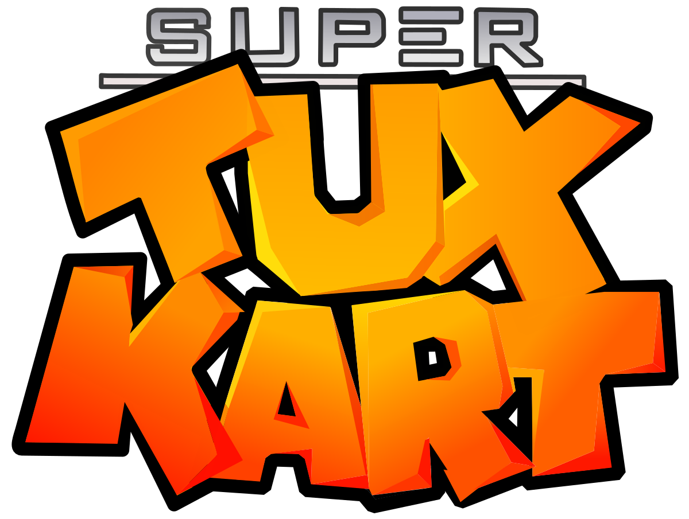

# SuperTuxKart 1.4
**Bitey Ports Package 🧳**   
Note: This does not provide any of the original code. This is a binary package, for the source code, [click here](https://github.com/supertuxkart/stk-code).

**SuperTuxKart** is a free, open-source kart racing game featuring Tux and friends in a 3D environment. This package is a portable binary port for use with the Bitey Package Manager's `ports` remote.

---

## 🛠️ About This Port

- **Version:** 1.4
- **Maintainer:** [leon8326](https://github.com/leon8326)
- **Original by:** [SuperTuxKart](https://supertuxkart.net)
